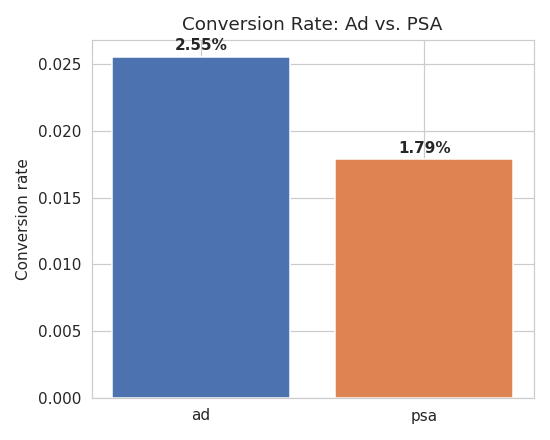

# Marketing A/B Test: Ad vs. PSA Conversion Analysis

**Does showing users an ad instead of a Public Service Announcement (PSA) increase conversion — and is the effect real or just noise?**

## TL;DR
- Analyzed 588,101 users from a real-world marketing A/B test.
- Users shown the ad converted at **2.55%** vs. **1.79%** for the PSA (control) group — a **+43% relative lift**.
- Two-proportion z-test: **p < 0.0001** (statistically significant), 95% CI for the lift excludes zero.
- Cross-validated with a chi-square test of independence — results agree.
- **Recommendation:** roll out the ad campaign; the effect is both statistically and practically significant.



## Business Context
Companies running ad campaigns need to answer two questions before spending more budget:
1. Did the campaign work at all?
2. If so, how much of the lift can be attributed to the ad itself, versus chance?

This project answers both using a proper hypothesis test rather than eyeballing the raw percentages — which matters,
because a naive comparison of two percentages can't tell you whether a difference is real or just sampling noise.

## Dataset
[Marketing A/B Testing (Kaggle)](https://www.kaggle.com/datasets/faviovaz/marketing-ab-testing) — 588,101 rows, no missing values or duplicates.

| Column | Description |
|---|---|
| user id | Unique user identifier |
| test group | `ad` (saw the advertisement) or `psa` (control) |
| converted | Whether the user purchased |
| total ads | Number of ads seen by the user |
| most ads day / most ads hour | When the user saw the most ads |

## Methodology
1. **Data cleaning** — verified no nulls, no duplicate rows/user IDs, checked group balance.
2. **EDA** — conversion rate by group, ad-exposure distribution, conversion by day/hour of peak exposure.
3. **Hypothesis testing** — two-proportion z-test (computed manually — see notebook for the formula) plus a
   chi-square test as a cross-check.
4. **Business translation** — converted the statistical result into "extra conversions per 10,000 users," the number
   a marketing stakeholder actually needs to make a budget decision.

## Key Finding: Correlation ≠ Causation (the part interviewers like to probe)
Users who saw *more* total ads had higher conversion — but this is observational, not experimental, for ad
*frequency*. Someone already inclined to buy may simply browse more (and see more ads along the way) without the
ads being what drove them there. The notebook calls this out explicitly and proposes the correct next experiment
(a randomized frequency test) rather than overclaiming causality it can't support.

## Repo Structure
```
marketing-ab-test/
├── data/marketing_AB.csv          # raw dataset
├── notebooks/                     # full analysis notebook (executed, with outputs)
├── figures/                       # exported chart PNGs
├── requirements.txt
└── README.md
```

## How to Run
```bash
pip install -r requirements.txt
jupyter notebook notebooks/marketing_ab_test_analysis.ipynb
```

## Tools
Python, pandas, NumPy, SciPy (hypothesis testing), Matplotlib, Seaborn.
